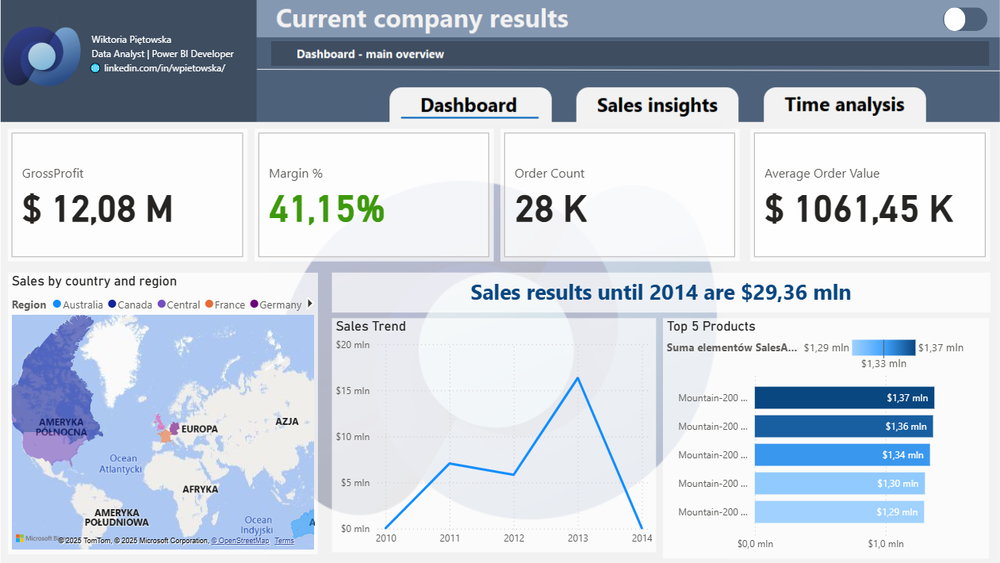
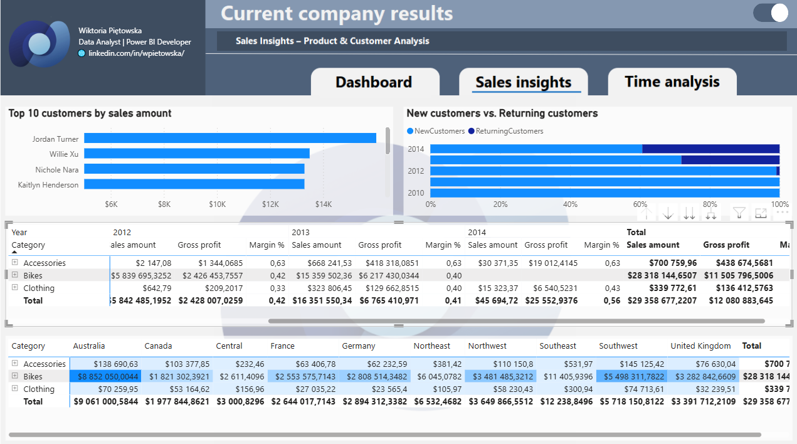
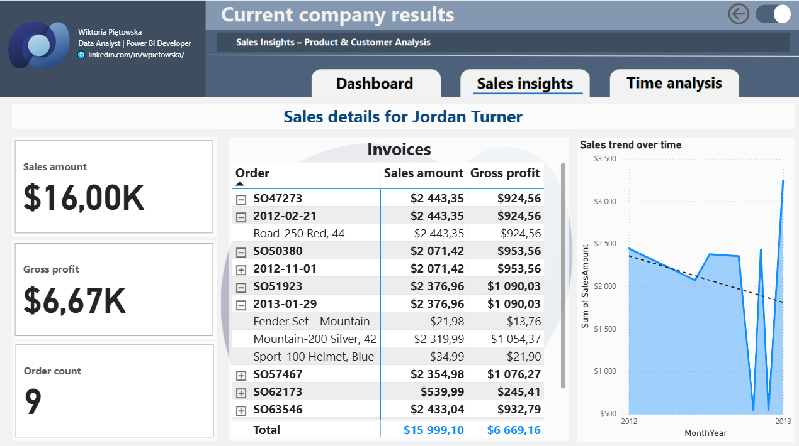
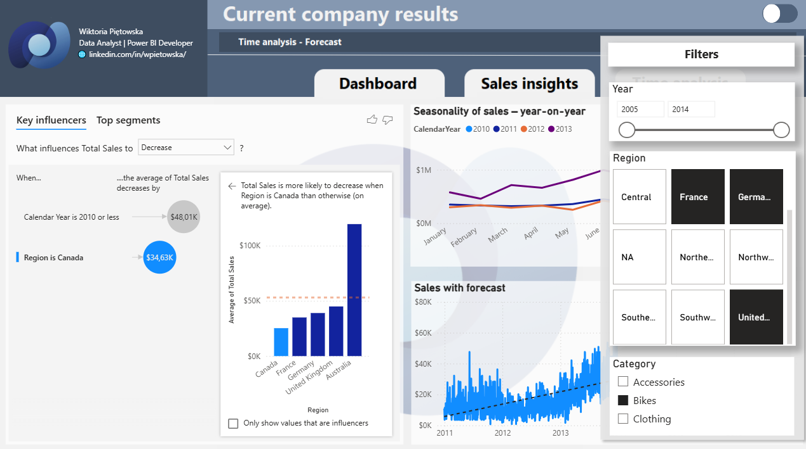

<h2 style="text-align: center;">Raport obecnych wyników firmy</h2>

<h3>Co zawiera raport?</h3>

Raport zawiera 3 zakładki znajdujące się w górnym menu: Dashboard (Pulpit nawigacyjny), Sales insights (Analiza sprzedaży), Time Analysis (Tredny i prognoza). 

<h3>Jak powstał raport?</h3>

W tym raporcie mój asystent AI wcielił się w rolę klienta menedżera (średniego szczebla w firmie handlowej) i przedstawił mi swoje oczekiwania wobec raportu w Power BI przygotowanego na bazie hurtowni **AdventureWorksDW2019**. Raport miał być użyteczny, intuicyjny i przypominać mini-aplikację (max 3 zakładki). 
Zależało mi, aby pierwsza strona zawierała kluczowe wskaźniki a pozostałe strony - szczegóły. Całość miała sprawiać wrażenia mini-aplikacji po której mógłby się poruszać klient korzystając, m.in. z:
- wykresu z drill through prowadzącym do faktur,
- wykresu z zastosowaniem hierarchii i drill down dla różnych poziomów szczegółowości,
- przycisków, które zmieniają wykres na stronie.

<h3>Odbiorca raportu</h3>

Raport jest przeznaczony dla menedżerów sprzedaży i marketingu. Potrzebują oni szybkiego podglądu bieżących wyników firmy oraz możliwości pogłębienia analizy (drill-through do szczegółów).
Pytania, na które raport ma odpowiadać:  
• Jak wyglądają aktualne wyniki sprzedaży w poprzednich lat?  
• Które produkty, kategorie i regiony generują największy przychód i marżę?  
• Którzy klienci są najważniejsi i jak kształtuje się ich rentowność?  
• Jakie są trendy sprzedażowe i czy widzimy sezonowość?  

<h3>Kluczowe KPI i wizualizacje</h3>

• KPI:  Zysk brutto, % Marży, Ilość zamówień, Średnia wartość zamówienia.  
• Wizualizacje: wykres liniowy (trendy), mapa (regiony sprzedaży), heatmap (produkty), tabelki z możliwością drill-through do faktur/klientów. 

<h3>Krok 1 – Przygotowanie szablonu tła raportu</h3>

Szablon przygotowałam za pomocą narzędzi graficznych m.in. Figma i GIMP.

<h3>Krok 2 – Przygotowanie źródła raportu oraz nadanie relacji pomiędzy widokami</h3>

1. **Pobieram dane** do Power BI za pomocą funkcji „Pobierz dane” -> SQL Server i łączę się z hurtownią AdventureWorksDW2019.
2. W MS SQL Server tworzę odpowiednie widoki, aby nie musieć wykonywać odatkowych operacjiw Power Query. Utworzyłam widok faktów vw_FactInternetSales_Denorm oraz 4 widoki wymiarów: vw_DimProduct, vw_DimCustomer, vw_DimSalesTerritory, vwDimDate i jedną tabelę przechowującą wszystkie miary.
3. Nadaję relacje zgodnie ze schematem gwiazdy.

   

<h3>Krok 3 – Utworzenie stron raportu z wysuwanym panelem filtrów</h3>

Zakładka 1: Dashboard menedżerski (dashboard)  

👉 Cel: szybki podgląd bieżących wyników  

• Kafle KPI (Zysk brutto, % Marży, Ilość zamówień, Średnia wartość zamówienia).   
• Wykres liniowy: trend sprzedaży.  
• Top 5 produktów wg przychodu (kolumnowy).  
• Mapa sprzedaży po regionach (kontynent/kraj/stan).  
• Informacja o obecnym wyniku sperzedaży do 2014 roku.  
• Wysuwane filtry za pomocą toggle switch: rok, region, kategoria produktu.  

Zakładka 2: Analiza sprzedaży (sales insights)  

👉 Cel: pogłębiona analiza sprzedaży wg produktów i klientów   

• Macierz (Kategoria produktu → Produkt → Kwota sprzedaży, Zysk, Marża) w podziela na lata.   
• Heatmap (region × produkt = sprzedaż).   
• Wykres słupkowy: Top 10 klientów wg przychodu z możliwością drill-through do faktur, KPI z wartością sprzedaży, zyskiem brutto, ilością zamówień i trendem sprzedaży w czasie.   
• Segmentacja klientów: nowi vs powracający.  
• Wysuwane filtry za pomocą toggle switch: rok, region, kategoria produktu.  

Zakładka 3: Trendy i prognoza (time analysis)  

👉 Cel: spojrzenie długoterminowe i przewidywania  

• Wykres liniowy: sprzedaż miesięczna z trendline i prognozą na kolejne 3 lata.   
• Sezonowość: porównanie sprzedaży rok do roku.  
• Wykres key influencers z analizą całkowitej sprzedaży w opraciu o region, kategorię produktu, płeć konsumenta, rok kalendarzowy, miesiąc. •	Wysuwane filtry za pomocą toggle switch: rok, region, kategoria produktu.  

<h3>Krok 4 – Wnioski na podstawie raprotu</h3>

👉 Na podstawie przygotowanego raportu w Power BI można zauważyć kilka kluczowych trendów: 

📈 Rok 2013 był najlepszym okresem sprzedażowym dla firmy.  
🗓️ W większości analizowanych lat czerwiec wyróżniał się jako miesiąc o najwyższej sprzedaży.  
🚴 Rowery to kategoria dominująca pod względem wartości sprzedaży – szczególnie w Australii oraz w regionie Southwest.  
👥 Analiza klientów wskazuje, że w badanym okresie pojawia się więcej nowych klientów niż powracających, co sugeruje skuteczność w pozyskiwaniu nowych odbiorców.  

    
<h3>WIZUALIZACJA RAPORTU</h3>

1. Strona pierwsza raportu
   
2. Strona druga raportu
   
3. Widok strony po przejściu drill through dla danego klienta
   
4. Strona trzecia raportu
   
5. Strona trzecia raportu z wysuniętym panelem filtrów
   
   
   
