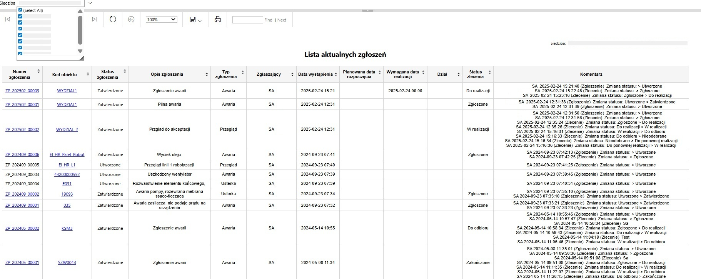
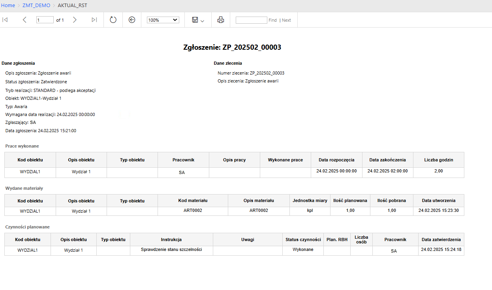
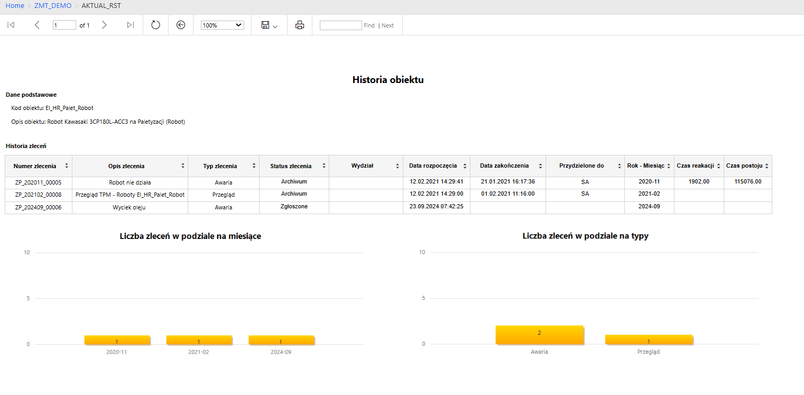

<h2 style="text-align: center;">Lista aktualnych zgłoszeń</h2>

<h3>Opis</h3>
Raport prezentuje zestawienie wszystkich aktualnych zgłoszeń wraz z możliwością przechodzenia do szczegółowych danych. Umożliwia filtrowanie wyników za pomocą parametru Siedziba z obsługą multi-select oraz funkcją „Select All”. 
Raport oparty jest na wcześniej przygotowanych widokach w SSMS z systemu testowego, które agregowały dane i upraszczały logikę raportu.
  

<h3>Nawigacja między raportami (drill-through)</h3>

**Numer zgłoszenia** - link prowadzący do szczegółowego widoku zgłoszenia, zawierającego: 
• tabelę wykonanych prac, 
• listę wydanych materiałów, 
• zaplanowane czynności. 
 
**Kod obiektu** – link przechodzący do raportu z historią obiektu, zawierającego: 
• tabelę wszystkich przeszłych zleceń, 
• wykres liczby zleceń w podziale na miesiące, 
• wykres liczby zleceń w podziale na typy. 

<h3>Funkcjonalności raportowe</h3>
•	Sortowanie wyników po każdej kolumnie 
•	Dynamiczne filtrowanie po siedzibach 
•	Przejrzysty układ tabelaryczny (tablix) 
•	Projekt dostosowany do wyświetlania po publikacji (SSRS web viewer) 
•	Pełna obsługa eksportu do Excel (z zachowaniem tabel i struktury danych) 
•	Raport pełnił rolę narzędzia operacyjnego do bieżącej kontroli zgłoszeń i szybkiej nawigacji po historii obiektów. 

<h3>Zdalna publikacja</h3>
Na GitHub zostały umieszczone wyłącznie zrzuty ekranu z pełną anonimizacją danych, bez oryginalnych plików .rdl z uwagi na wrażliwe dane.

<h3>Wizualizacja raportu</h3>

1. Strona główna raportu
  
2. Szczegóły zgłoszenia
  
3. Historia obiektu
  

