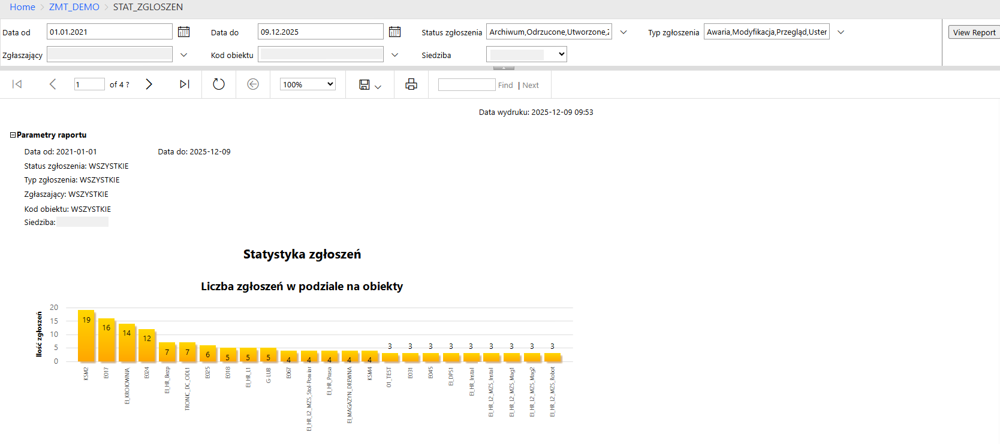
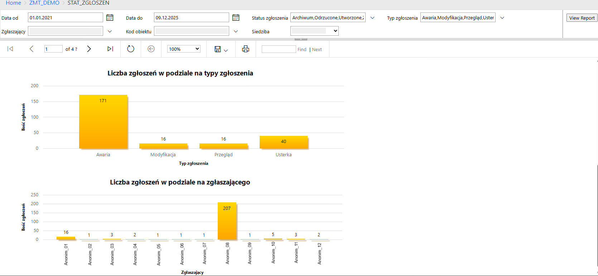
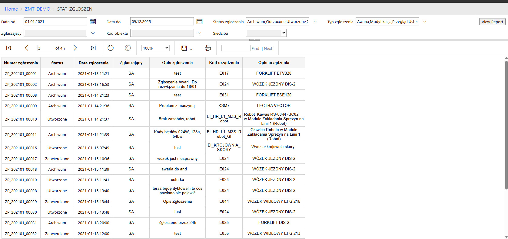

<h2 style="text-align: center;">Statystyka zgłoszeń</h2>

<h3>Opis</h3>
Raport prezentuje przekrojową analizę zgłoszeń w wybranym okresie. Został zaprojektowany zarówno do podglądu po publikacji na serwerze SSRS, jak i do eksportu do PDF, co umożliwiało szybkie udostępnianie raportu innym użytkownikom. 
Raport oparty jest na wcześniej przygotowanych widokach w SSMS z systemu testowego, które agregowały dane i upraszczały logikę raportu.

<h3>Parametry wejściowe</h3>
•	Data od / Data do 
•	Status zgłoszenia – multi-select + select all 
•	Typ zgłoszenia – multi-select + select all 
•	Zgłaszający – multi-select + select all 
•	Kod obiektu – multi-select + select all 
•	Siedziba – multi-select + select all 
Uwaga: Wszystkie parametry poza datami były domyślnie wypełnione wartościami wskazanymi przez klienta.

<h3>Rozwijane parametry raportu</h3>
•	Parametry można rozwijać przyciskiem „+” i ukrywać przyciskiem „−”, co ułatwia kontrolę widoku raportu.

<h3>Wykresy i wizualizacje</h3>
•	Liczba zgłoszeń w podziale na obiekty 
•	Liczba zgłoszeń w podziale na typy zgłoszeń 
•	Liczba zgłoszeń w podziale na zgłaszających 
•	Pełna lista zgłoszeń w tabeli spełniająca wybrane parametry wejściowe 

<h3>Funkcjonalności raportowe</h3>
•	Raport dostosowany do publikacji na serwerze SSRS (web viewer) 
•	Obsługa eksportu do PDF 
•	Możliwość filtrowania danych przez wszystkie parametry wejściowe 
•	Przejrzysty układ tabelaryczny oraz wykresy wspierające szybkie podejmowanie decyzji operacyjnych 

<h3>Zdalna publikacja</h3>
Na GitHub umieszczono wyłącznie zrzuty ekranu z pełną anonimizacją, bez plików .rdl z uwagi na wrażliwe dane.

<h3>Wizualizacja raportu</h3>

